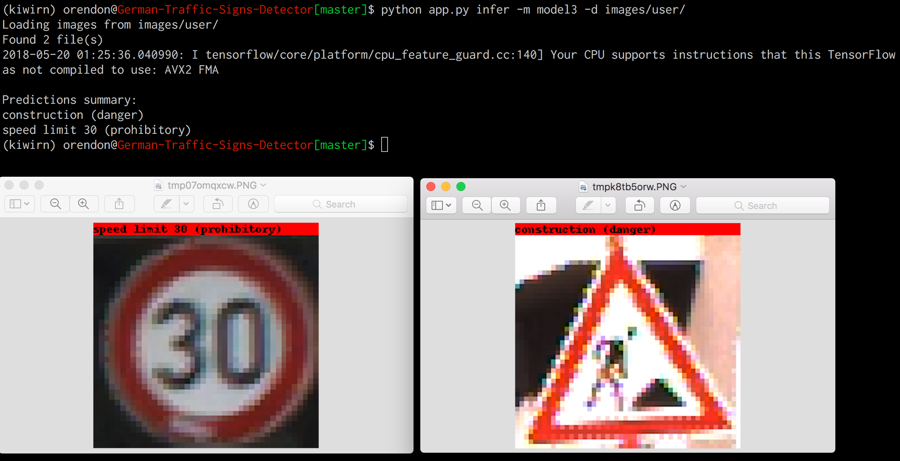

# German Traffic Signs Detector

Solution for Kiwi/RutaN [Deep Learning Challenge](https://github.com/KiwiCampusChallenge/Kiwi-Campus-Challenge/blob/master/Deep-Learning-Challenge.md)

## CLI usage

The main features of the app are `train`, `test` and `infer`.

**Here is a [SHORT VIDEO](https://cl.ly/0d232o450U1t) explaining the CLI usage for `model1` (the same commands apply for `model2` and `model3`)**

Also, you can use `python app.py --help` to know more about the commands

## Implemented models

### model1
Logistic Regression using Scikit-learn.

Implementation on [kiwi/logitsk.py](kiwi/logitsk.py) file.

### model2
Logistic Regression using Tensorflow

Implementation on [kiwi/logittf.py](kiwi/logittf.py) file.

### model3
LeNet-5 using Tensorflow, based on [Yann Lecun paper](http://yann.lecun.com/exdb/publis/pdf/lecun-01a.pdf).

Implementation on [kiwi/lenet5.py](kiwi/lenet5.py) file.

## Inference
Here is an example of the `infer` command output using LeNet-5 model.

## Dependencies
This are the main packages used:

- Python 3.6.3
- numpy
- Click
- tensorflow
- scikit-learn
- opencv-python
- jupyter
- Pillow
- scipy

Full details on the `requirements.txt` file.